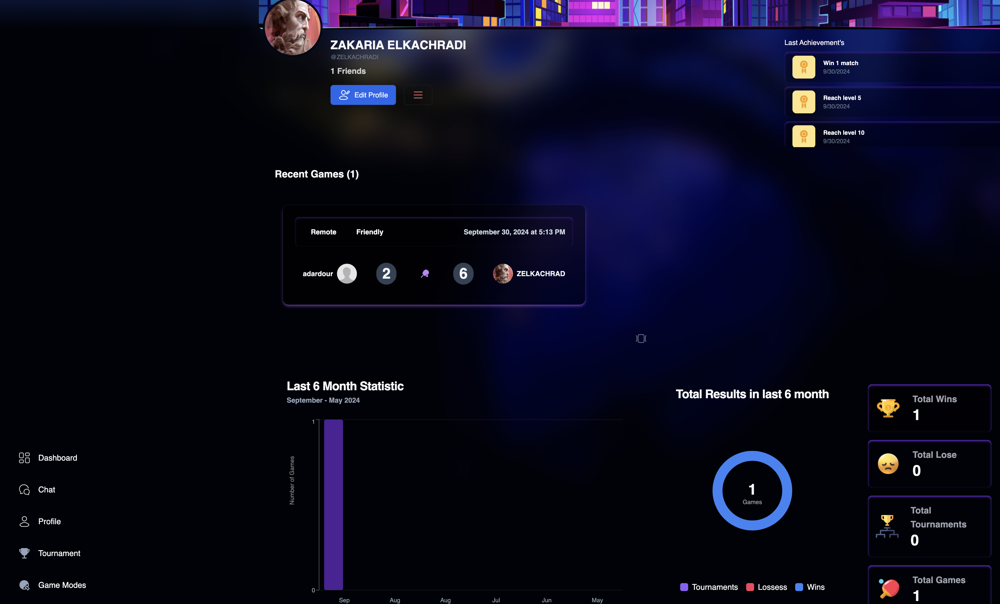

# ft_transcendence

ft_transcendence is a full-featured web application offering multiplayer gaming, real-time chat, user profiles, match history, and more. Built using modern web technologies, it combines a powerful backend with an intuitive frontend for an engaging user experience.

## Table of Contents
- [Features](#features)
- [Tech Stack](#tech-stack)
- [Grade and Subject](#grade-and-subject)
- [Screenshots](#screenshots)
- [Demo Video](#demo-video)

---

## Features
- **Profiles**: View, edit and delete player profiles.
- **Friends & Blocks**: Add friends or block other users.
- **Chat**: Real-time messaging between users.
- **Match History**: View stats and history of past matches.
- **Stats**: Player statistics and performance tracking.
- **Notifications**: Real-time notifications for game invites, messages, etc.
- **Local Game & Tournaments**: Host local games and tournaments.
- **Remote Tournament**: Join remote tournaments for competitive gameplay.
- **Multiplayer 2v2**: Play with or against friends in team-based matches.

## Tech Stack
- **Frontend**: Next.js, TypeScript, TailwindCSS
- **Backend**: Django, Django Channels, WebSockets, PostgreSQL
- **Deployment**: Docker, Nginx
- **Authentication**: OAuth 2.0, JWT

## Grade and Subject
[View the Subject PDF](subject.pdf)

## Demo Video
https://github.com/user-attachments/assets/20025dcd-6a7f-4018-bc40-e834c3893d96

## Screenshots

